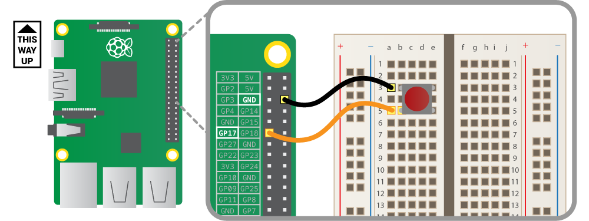

# Morse-Code-Translator
This is a one way morse code translator that uses a bread board, button, and some wires to create a system that can translate morse code into text.

The code outputs the resulting text after each character is input. In the beginning it mights be difficult to get the hang of the timing, but it comes with practice, so you can uncomment the lines that say: print(Morse) to see what you have outputted in morse.
The button is initialized as being at Gpio pin 17, change this depending on your setup on line 10.

The next couple updates should also include outputting the resulting text into speech using a microphone.

Circuit Diagram:

